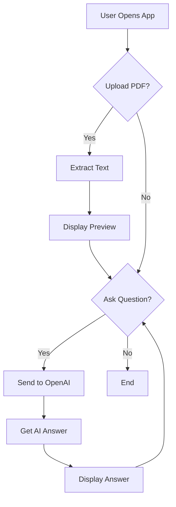

# AI Document Q&A System - Complete Project Plan

## Overview
This plan breaks down your AI Document Q&A System into 4 major phases with executable subparts. Each subpart includes clear learning objectives, exact steps, testing methods, and verification checkpoints.

---

## PHASE 1: DEVELOPMENT ENVIRONMENT SETUP
**Total Estimated Time: 45-60 minutes**
**Goal: Get your computer ready for Python development**

### PART 1.1: Python Environment & IDE Setup (15 minutes)

#### SUBPART 1.1.1: Install Python 3.11 and Verify Installation
- **Learning objective**: Understand what Python is and why we need version 3.11
- **Steps**:
  1. Go to https://www.python.org/downloads/
  2. Download Python 3.11 (or latest 3.x version)
  3. Run the installer (Windows: check "Add Python to PATH")
  4. Open terminal/command prompt
  5. Type `python --version` and press Enter
- **Test**: Terminal shows "Python 3.11.x"
- **Checkpoint**: Python command works and shows version 3.11

#### SUBPART 1.1.2: Install VS Code (or Use Existing Editor)
- **Learning objective**: Learn what an IDE is and why VS Code is recommended for Python
- **Steps**:
  1. Go to https://code.visualstudio.com/
  2. Download and install VS Code
  3. Open VS Code
  4. Install Python extension (click "Install" when prompted)
- **Test**: VS Code opens without errors
- **Checkpoint**: Python extension is installed and active

#### SUBPART 1.1.3: Create Project Folder Structure
- **Learning objective**: Understand why we need organized folder structures
- **Steps**:
  1. Create folder: `doc-qa-project` on Desktop
  2. Inside, create folders: `app`, `utils`, `tests`, `data`
- **Test**: Folders visible in File Explorer
- **Checkpoint**: All 4 folders exist

#### SUBPART 1.1.4: Create and Activate Virtual Environment
- **Learning objective**: Understand what a virtual environment is and why we use it
- **Steps**:
  1. Open terminal in project folder
  2. Type: `python -m venv venv`
  3. Activate (Windows): `venv\Scripts\activate`
  4. You should see `(venv)` at the start of your terminal line
- **Test**: Terminal shows "(venv)" prefix
- **Checkpoint**: Virtual environment is active

---

### PART 1.2: Required Libraries Installation (15 minutes)

#### SUBPART 1.2.1-1.2.4: Install All Required Libraries
- **Learning objective**: Understand what libraries/dependencies are in Python
- **Steps**:
  1. With venv active, run these commands one by one:
     ```
     pip install PyPDF2
     pip install openai
     pip install streamlit
     pip install python-dotenv
     ```
- **Test**: Each command completes without error
- **Checkpoint**: All 4 libraries installed successfully

#### SUBPART 1.2.5: Create requirements.txt
- **Learning objective**: Learn why we need a requirements.txt file
- **Steps**:
  1. Create file `requirements.txt` in project root
  2. Add these lines:
     ```
     PyPDF2==3.0.1
     openai==1.12.0
     streamlit==1.32.0
     python-dotenv==1.0.1
     ```
- **Test**: File exists and contains correct package names
- **Checkpoint**: requirements.txt is saved

---

### PART 1.3: Project Structure & Git Setup (15 minutes)

#### SUBPART 1.3.1: Initialize Git Repository
- **Learning objective**: Understand what Git is and why we use version control
- **Steps**:
  1. Open terminal in project folder
  2. Type: `git init`
  3. Type: `git config user.name "Your Name"`
  4. Type: `git config user.email "your@email.com"`
- **Test**: Hidden `.git` folder created
- **Checkpoint**: Git repository initialized

#### SUBPART 1.3.2: Create .gitignore File
- **Learning objective**: Learn what files should not be committed to Git
- **Steps**:
  1. Create file `.gitignore`
  2. Add these lines:
     ```
     venv/
     __pycache__/
     *.pyc
     .env
     .streamlit/
     ```
- **Test**: File exists with correct content
- **Checkpoint**: .gitignore saved

#### SUBPART 1.3.3-1.3.4: Create Directories and Init Files
- **Learning objective**: Understand Python package structure
- **Steps**:
  1. Create empty files: `app/__init__.py`, `utils/__init__.py`, `tests/__init__.py`
- **Test**: All __init__.py files exist
- **Checkpoint**: Project structure complete

---

## PHASE 2: PDF TEXT EXTRACTION
**Total Estimated Time: 60-75 minutes**
**Goal: Extract text from PDF files**

### PART 2.1: PDF Extraction Core Function (20 minutes)

#### SUBPART 2.1.1: Understand PDF Structure and PyPDF2 Basics
- **Learning objective**: Learn how PDFs store text and how PyPDF2 reads it
- **Steps**:
  1. Create a sample PDF file (or download one)
  2. Read PyPDF2 documentation concepts
  3. Understand: PDF → Pages → Text extraction
- **Test**: Can explain how PDFs store text
- **Checkpoint**: Concept understood before coding

#### SUBPART 2.1.2: Create pdf_utils.py with extract_text() Function
- **Learning objective**: Write your first Python function that processes files
- **Steps**:
  1. Create `utils/pdf_utils.py`
  2. Add code:
     ```python
     import PyPDF2
     
     def extract_text_from_pdf(pdf_file):
         """Extract text from uploaded PDF file."""
         # Create PDF reader object
         pdf_reader = PyPDF2.PdfReader(pdf_file)
         
         # Extract text from all pages
         text = ""
         for page in pdf_reader.pages:
             text += page.extract_text() + "\n"
         
         return text
     ```
- **Test**: Function accepts PDF and returns text string
- **Checkpoint**: Function works with simple PDF

#### SUBPART 2.1.3: Add Error Handling for Corrupted PDFs
- **Learning objective**: Learn why error handling is critical
- **Steps**:
  1. Add try-except block around PDF reading
  2. Return user-friendly error message
  3. Handle: wrong file type, corrupted file, empty PDF
- **Test**: Upload non-PDF file, see error message
- **Checkpoint**: Errors handled gracefully

#### SUBPART 2.1.4: Test PDF Extraction with Sample File
- **Learning objective**: Verify your code actually works
- **Steps**:
  1. Create test script `test_extraction.py`
  2. Add sample PDF to `data/` folder
  3. Run: `python test_extraction.py`
  4. Print extracted text
- **Test**: Text is extracted and readable
- **Checkpoint**: Extraction works correctly

---

### PART 2.2: PDF Processing Improvements (20 minutes)

#### SUBPART 2.2.1: Handle Multi-page PDFs
- **Learning objective**: Understand how to loop through multiple pages
- **Steps**:
  1. Modify extract_text() to track page numbers
  2. Add page number to output
  3. Test with 5+ page PDF
- **Test**: All pages extracted in order
- **Checkpoint**: Multi-page PDF works

#### SUBPART 2.2.2: Clean Extracted Text
- **Learning objective**: Learn text processing techniques
- **Steps**:
  1. Add text cleaning function
  2. Remove extra whitespace
  3. Handle special characters
- **Test**: Before/after comparison shows cleaner output
- **Checkpoint**: Text is cleaned

#### SUBPART 2.2.3: Add Progress Indicator
- **Learning objective**: Improve user experience for large files
- **Steps**:
  1. Add print statements showing progress
  2. Show "Processing page X of Y"
- **Test**: Progress shown for large PDFs
- **Checkpoint**: Progress indicator works

#### SUBPART 2.2.4: Create Unit Tests
- **Learning objective**: Learn what unit tests are and why they matter
- **Steps**:
  1. Create `tests/test_pdf_utils.py`
  2. Write tests for: success case, empty PDF, wrong file type
- **Test**: Run `pytest tests/`
- **Checkpoint**: All tests pass

---

### PART 2.3: Text Chunking for AI Processing (20 minutes)

#### SUBPART 2.3.1: Understand Why Text Needs to Be Chunked
- **Learning objective**: Learn about AI token limits and why chunking is necessary
- **Steps**:
  1. Research: What are tokens?
  2. Learn: GPT-4o-mini has ~128K token limit
  3. Understand: Need to fit relevant text in prompt
- **Test**: Can explain chunking purpose
- **Checkpoint**: Concept understood

#### SUBPART 2.3.2: Create text_chunker.py
- **Learning objective**: Write function to split large text into chunks
- **Steps**:
  1. Create `utils/text_chunker.py`
  2. Add code:
     ```python
     def chunk_text(text, chunk_size=1000, chunk_overlap=100):
         """Split text into overlapping chunks."""
         chunks = []
         start = 0
         
         while start < len(text):
             end = start + chunk_size
             chunk = text[start:end]
             chunks.append(chunk)
             start = end - chunk_overlap
         
         return chunks
     ```
- **Test**: Function returns list of text chunks
- **Checkpoint**: Chunking works

#### SUBPART 2.3.3: Implement Overlap Between Chunks
- **Learning objective**: Understand why overlap helps with context
- **Steps**:
  1. Adjust chunk_overlap parameter
  2. Ensure no information is lost at boundaries
- **Test**: Chunks share some content
- **Checkpoint**: Overlap implemented correctly

#### SUBPART 2.3.4: Test Chunking with Different Sizes
- **Learning objective**: Learn optimal chunk sizes for AI
- **Steps**:
  1. Test with chunk_size=500, 1000, 2000
  2. Compare results
  3. Document best size for this project
- **Test**: Different sizes produce different chunk counts
- **Checkpoint**: Chunk sizes verified

---

## PHASE 3: OPENAI API INTEGRATION
**Total Estimated Time: 75-90 minutes**
**Goal: Connect to OpenAI and get AI answers**

### PART 3.1: OpenAI API Setup (20 minutes)

#### SUBPART 3.1.1: Create OpenAI Account and Get API Key
- **Learning objective**: Learn how to access OpenAI services
- **Steps**:
  1. Go to https://platform.openai.com/
  2. Sign up for account
  3. Go to API keys section
  4. Create new secret key
  5. COPY the key (you won't see it again!)
- **Test**: You have a secret key starting with "sk-"
- **Checkpoint**: API key copied securely

#### SUBPART 3.1.2: Understand API Pricing
- **Learning objective**: Understand costs before spending money
- **Steps**:
  1. Go to OpenAI pricing page
  2. Find GPT-4o-mini pricing
  3. Learn: ~$0.15 per 1M input tokens
  4. Set budget alert in account
- **Test**: Can explain approximate cost per question
- **Checkpoint**: Pricing understood

#### SUBPART 3.1.3: Create .env File and Store API Key Securely
- **Learning objective**: Learn about environment variables and security
- **Steps**:
  1. Create `.env` file in project root
  2. Add line: `OPENAI_API_KEY=sk-your-key-here`
  3. Verify .gitignore includes .env
- **Test**: .env file exists, not in Git
- **Checkpoint**: API key stored securely

#### SUBPART 3.1.4: Create config.py to Load Environment Variables
- **Learning objective**: Learn how to use python-dotenv
- **Steps**:
  1. Create `utils/config.py`
  2. Add code:
     ```python
     from dotenv import load_dotenv
     import os
     
     load_dotenv()
     
     def get_openai_api_key():
         """Get OpenAI API key from environment."""
         return os.getenv("OPENAI_API_KEY")
     ```
- **Test**: Function returns the API key
- **Checkpoint**: Config works

---

### PART 3.2: OpenAI Integration Code (30 minutes)

#### SUBPART 3.2.1: Create openai_client.py
- **Learning objective**: Learn how to connect to OpenAI API
- **Steps**:
  1. Create `utils/openai_client.py`
  2. Add code:
     ```python
     from openai import OpenAI
     from utils.config import get_openai_api_key
     
     client = OpenAI(api_key=get_openai_api_key())
     ```
- **Test**: Client object created without errors
- **Checkpoint**: Connection established

#### SUBPART 3.2.2: Implement get_answer() Function
- **Learning objective**: Learn how to send prompts to AI
- **Steps**:
  1. Add function:
     ```python
     def get_answer(context, question):
         """Get AI answer based on document context."""
         prompt = f"Based on this document, answer the question.\n\nDocument:\n{context}\n\nQuestion: {question}\n\nAnswer:"
         
         response = client.chat.completions.create(
             model="gpt-4o-mini",
             messages=[{"role": "user", "content": prompt}],
             temperature=0.3
         )
         
         return response.choices[0].message.content
     ```
- **Test**: Function returns text answer
- **Checkpoint**: Basic Q&A works

#### SUBPART 3.2.3: Add Retry Logic for API Rate Limits
- **Learning objective**: Handle API errors gracefully
- **Steps**:
  1. Add try-except with exponential backoff
  2. Handle rate limit errors specifically
  3. Add max retries (3 attempts)
- **Test**: Simulate rate limit, see retry work
- **Checkpoint**: Retry logic implemented

#### SUBPART 3.2.4: Add Error Handling
- **Learning objective**: Make code robust
- **Steps**:
  1. Handle: no API key, invalid key, network errors
  2. Return user-friendly error messages
- **Test**: Various error conditions handled
- **Checkpoint**: No crash on errors

#### SUBPART 3.2.5: Test API Connection
- **Learning objective**: Verify everything works together
- **Steps**:
  1. Create test script
  2. Ask simple question: "What is 2+2?"
  3. Get response
- **Test**: AI responds correctly
- **Checkpoint**: API integration complete

---

### PART 3.3: QA System Integration (25 minutes)

#### SUBPART 3.3.1: Understand Prompt Engineering Basics
- **Learning objective**: Learn how to get better AI responses
- **Steps**:
  1. Research: What makes good prompts?
  2. Learn: Be specific, provide context
  3. Understand: System vs user prompts
- **Test**: Can explain prompt basics
- **Checkpoint**: Concept understood

#### SUBPART 3.3.2: Create Prompt Template
- **Learning objective**: Create reusable prompt patterns
- **Steps**:
  1. Create `utils/prompt_template.py`
  2. Add template:
     ```python
     QA_SYSTEM_PROMPT = """You are a helpful assistant that answers questions about documents. 
     Provide clear, accurate answers based only on the document content provided.
     If the answer is not in the document, say so."""
     
     def create_qa_prompt(document_text, question):
         return f"""Document content:
     {document_text}
     
     Question: {question}
     
     Please provide a detailed answer based on the document above."""
     ```
- **Test**: Template creates proper prompt
- **Checkpoint**: Prompt template works

#### SUBPART 3.3.3: Integrate PDF Text with OpenAI
- **Learning objective**: Connect all pieces together
- **Steps**:
  1. Combine: PDF extraction → text chunking → AI Q&A
  2. Use first chunk if text is short
  3. Handle long documents
- **Test**: Full pipeline works
- **Checkpoint**: Integration complete

#### SUBPART 3.3.4: Create Test QA System
- **Learning objective**: Verify entire system works
- **Steps**:
  1. Create sample document
  2. Ask questions about it
  3. Verify answers are correct
- **Test**: End-to-end test passes
- **Checkpoint**: QA system works

#### SUBPART 3.3.5: Test Full Q&A Flow
- **Learning objective**: Final integration test
- **Steps**:
  1. Run complete test
  2. Upload PDF → Extract → Ask Question → Get Answer
  3. Verify answer relates to document
- **Test**: Full flow works
- **Checkpoint**: Ready for web interface

---

## PHASE 4: STREAMLIT WEB INTERFACE
**Total Estimated Time: 90-105 minutes**
**Goal: Build the user-facing web application**

### PART 4.1: Streamlit Basics (25 minutes)

#### SUBPART 4.1.1: Understand Streamlit App Structure
- **Learning objective**: Learn what Streamlit is and how it works
- **Steps**:
  1. Read Streamlit basics
  2. Understand: It's Python-only, no HTML/CSS needed
  3. Learn: Script runs top to bottom on each interaction
- **Test**: Can explain how Streamlit works
- **Checkpoint**: Concept understood

#### SUBPART 4.1.2: Create main.py with Basic App Layout
- **Learning objective**: Write your first Streamlit app
- **Steps**:
  1. Create `app/main.py`
  2. Add code:
     ```python
     import streamlit as st
     
     st.title("Document Q&A System")
     st.write("Upload a PDF and ask questions about it!")
     ```
- **Test**: App displays title and message
- **Checkpoint**: Basic app runs

#### SUBPART 4.1.3: Add Title, Description, and Sidebar
- **Learning objective**: Learn Streamlit layout components
- **Steps**:
  1. Add st.title(), st.header(), st.markdown()
  2. Create sidebar with st.sidebar
  3. Add app description
- **Test**: UI elements visible
- **Checkpoint**: Layout complete

#### SUBPART 4.1.4: Test Streamlit App Locally
- **Learning objective**: Learn how to run Streamlit apps
- **Steps**:
  1. Run: `streamlit run app/main.py`
  2. Browser opens automatically
  3. See your app running
- **Test**: App opens in browser
- **Checkpoint**: Streamlit works

---

### PART 4.2: PDF Upload Component (25 minutes)

#### SUBPART 4.2.1: Add File Uploader Widget
- **Learning objective**: Learn Streamlit file handling
- **Steps**:
  1. Add `st.file_uploader()`
  2. Set type=["pdf"]
  3. Add label
- **Test**: File upload button appears
- **Checkpoint**: Uploader works

#### SUBPART 4.2.2: Integrate PDF Extraction
- **Learning objective**: Connect uploader to your extraction code
- **Steps**:
  1. Import pdf_utils
  2. Call extract_text when file uploaded
  3. Store in session state
- **Test**: Upload PDF, see text extracted
- **Checkpoint**: Integration works

#### SUBPART 4.2.3: Display Extracted Text Preview
- **Learning objective**: Learn to display content in Streamlit
- **Steps**:
  1. Add `st.text_area()` to show extracted text
  2. Make it read-only
  3. Add "Show/Hide" toggle
- **Test**: Text preview displays
- **Checkpoint**: Preview works

#### SUBPART 4.2.4: Add File Info Display
- **Learning objective**: Show useful file metadata
- **Steps**:
  1. Display: file name, file size, page count
  2. Format sizes nicely (KB, MB)
- **Test**: Info displays correctly
- **Checkpoint**: File info shown

#### SUBPART 4.2.5: Test PDF Upload Flow
- **Learning objective**: Verify complete upload experience
- **Steps**:
  1. Upload a PDF
  2. See extraction happen
  3. Verify preview shows
- **Test**: Full upload flow works
- **Checkpoint**: Upload complete

---

### PART 4.3: Question & Answer Interface (25 minutes)

#### SUBPART 4.3.1: Add Text Input for Questions
- **Learning objective**: Learn Streamlit input widgets
- **Steps**:
  1. Add `st.text_input()` for question
  2. Add placeholder text
  3. Add label
- **Test**: Input field appears
- **Checkpoint**: Input works

#### SUBPART 4.3.2: Create Submit Button and Form
- **Learning objective**: Learn Streamlit form handling
- **Steps**:
  1. Add `st.form()` with submit button
  2. Use `st.form_submit_button()`
  3. Handle form submission
- **Test**: Button appears and works
- **Checkpoint**: Form works

#### SUBPART 4.3.3: Display AI Answer with Markdown
- **Learning objective**: Learn to display AI responses
- **Steps**:
  1. Call get_answer function
  2. Display with `st.markdown()`
  3. Add styling
- **Test**: Answer displays correctly
- **Checkpoint**: Answer shows

#### SUBPART 4.3.4: Add Loading Spinner
- **Learning objective**: Improve UX during processing
- **Steps**:
  1. Add `st.spinner("Processing...")`
  2. Wrap API call in spinner
  3. Show while waiting
- **Test**: Spinner shows during processing
- **Checkpoint**: Spinner works

#### SUBPART 4.3.5: Add Chat History
- **Learning objective**: Learn Streamlit session state
- **Steps**:
  1. Use st.session_state
  2. Store question/answer pairs
  3. Display chat history
- **Test**: History persists in session
- **Checkpoint**: Chat history works

---

### PART 4.4: UI Polish & Error Handling (20 minutes)

#### SUBPART 4.4.1: Add Custom CSS
- **Learning objective**: Learn Streamlit styling
- **Steps**:
  1. Add `st.markdown()` with unsafe_allow_html
  2. Style buttons, inputs
  3. Add custom colors
- **Test**: Styles applied
- **Checkpoint**: Custom styling works

#### SUBPART 4.4.2: Add Error Messages
- **Learning objective**: Make app user-friendly
- **Steps**:
  1. Add `st.error()` for errors
  2. Add `st.warning()` for warnings
  3. Add `st.success()` for success
- **Test**: Messages display correctly
- **Checkpoint**: Errors handled nicely

#### SUBPART 4.4.3: Session State Management
- **Learning objective**: Learn state management in Streamlit
- **Steps**:
  1. Initialize session state variables
  2. Handle app refresh
  3. Clear history option
- **Test**: State persists correctly
- **Checkpoint**: State works

#### SUBPART 4.4.4: Test Complete User Flow
- **Learning objective**: Final end-to-end test
- **Steps**:
  1. Run complete test:
     - Upload PDF
     - See preview
     - Ask question
     - Get answer
     - See history
- **Test**: Everything works
- **Checkpoint**: App complete

#### SUBPART 4.4.5: Final Code Cleanup
- **Learning objective**: Make code production-ready
- **Steps**:
  1. Add comments to all functions
  2. Remove print statements
  3. Organize imports
  4. Check code style
- **Test**: Code is clean and readable
- **Checkpoint**: Code ready for deployment

---

## PHASE 5: DEPLOYMENT & DOCUMENTATION
**Total Estimated Time: 60-75 minutes**
**Goal: Go live with your app**

### PART 5.1: GitHub Repository Setup (20 minutes)

#### SUBPART 5.1.1: Create GitHub Account (If Needed)
- **Learning objective**: Learn to use GitHub
- **Steps**:
  1. Go to github.com
  2. Sign up for free account
  3. Verify email
- **Test**: Account created
- **Checkpoint**: Can log in to GitHub

#### SUBPART 5.1.2: Create New Repository
- **Learning objective**: Learn to create repos
- **Steps**:
  1. Click "New repository"
  2. Name: "doc-qa-system"
  3. Make it Public
  4. Don't add README yet
- **Test**: Repository created
- **Checkpoint**: Repo exists

#### SUBPART 5.1.3: Push Local Code to GitHub
- **Learning objective**: Learn Git push workflow
- **Steps**:
  1. Run:
     ```
     git add .
     git commit -m "Initial commit"
     git branch -M main
     git remote add origin https://github.com/yourusername/doc-qa-system.git
     git push -u origin main
     ```
- **Test**: Code appears on GitHub
- **Checkpoint**: Code pushed successfully

#### SUBPART 5.1.4: Verify Repository is Public
- **Learning objective**: Confirm deployment requirements
- **Steps**:
  1. Open repository in browser
  2. Confirm it's public
  3. Verify all files are there
- **Test**: Anyone can view repo
- **Checkpoint**: Repo is public

---

### PART 5.2: Streamlit Cloud Deployment (20 minutes)

#### SUBPART 5.2.1: Create Streamlit Cloud Account
- **Learning objective**: Learn Streamlit Cloud
- **Steps**:
  1. Go to share.streamlit.io
  2. Sign up with GitHub
  3. Authorize Streamlit
- **Test**: Account created
- **Checkpoint**: Can access dashboard

#### SUBPART 5.2.2: Connect GitHub Repository
- **Learning objective**: Link GitHub to Streamlit
- **Steps**:
  1. Click "New app"
  2. Select your GitHub repo
  3. Select branch (main)
  4. Set main file path (app/main.py)
- **Test**: Repository connected
- **Checkpoint**: Repo selected

#### SUBPART 5.2.3: Configure Environment Variables
- **Learning objective**: Secure API key in deployment
- **Steps**:
  1. In Streamlit Cloud, go to Settings
  2. Add secret: OPENAI_API_KEY
  3. Paste your API key
  4. Save settings
- **Test**: Secret configured
- **Checkpoint**: API key secured

#### SUBPART 5.2.4: Deploy the Application
- **Learning objective**: Launch your app
- **Steps**:
  1. Click "Deploy"
  2. Wait for deployment (1-2 minutes)
  3. See success message
- **Test**: App deployed
- **Checkpoint**: App is live

#### SUBPART 5.2.5: Test Deployed App
- **Learning objective**: Verify deployment works
- **Steps**:
  1. Open the deployed URL
  2. Upload a PDF
  3. Ask a question
  4. Get an answer
- **Test**: Full flow works
- **Checkpoint**: Deployment successful

---

### PART 5.3: README Documentation (20 minutes)

#### SUBPART 5.3.1-5.3.7: Create Professional README
- **Learning objective**: Learn to write documentation
- **Steps**:
  1. Create comprehensive README.md:
     - Project title and description
     - Features list
     - Tech stack
     - Installation instructions
     - Usage instructions
     - Deployment link
     - Screenshot
     - License
- **Test**: README is complete
- **Checkpoint**: All sections present

---

## FINAL VERIFICATION

### All Deliverables Checklist:
- [ ] Working web app (upload PDF → ask question → get answer)
- [ ] Clean code with comments
- [ ] Deployed to Streamlit Cloud (live URL)
- [ ] Professional README with screenshot
- [ ] Code on public GitHub repository

### Project Complete When:
1. You can open the live URL
2. Upload any PDF
3. Ask a question about it
4. Get an accurate AI-generated answer
5. All code is on GitHub with good README

---

## Mermaid Diagram: Complete Workflow



---

## Tips for Success:
1. **Test often**: After each subpart, verify it works
2. **Don't skip errors**: They teach you a lot
3. **Ask for help**: Use documentation, search, ask
4. **Take breaks**: If stuck, step away and return
5. **Document as you go**: Write comments immediately

---

*Plan created for: AI Document Q&A System*
*Tech Stack: Python 3.11, OpenAI GPT-4o-mini, PyPDF2, Streamlit*
*Estimated Total Time: 330-405 minutes (5.5-6.75 hours)*
